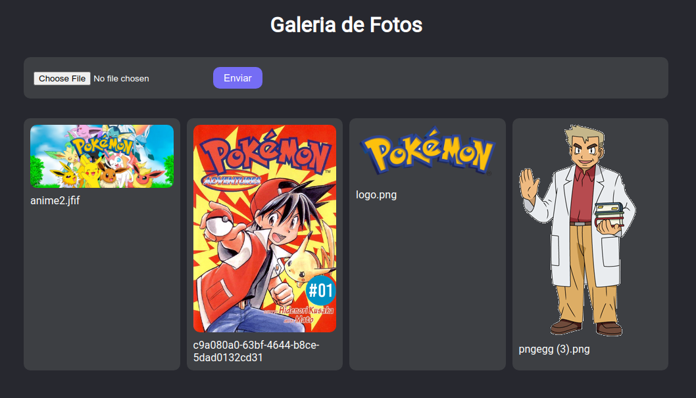
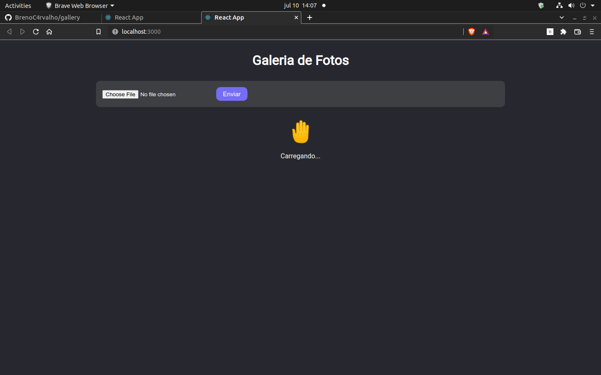

# Gallery 📸​

## 👀 Como ficou ???

</img>
----------
</img>
----------

## 🧑‍💻 Tecnologias usadas

O projeto foi desenvolvido com as seguintes tecnologias:
- [TypeScript](https://www.typescriptlang.org/)
- [React JS](https://pt-br.reactjs.org/)
- [Styled-components](https://styled-components.com/)
- [Firebase](https://firebase.google.com/?gclsrc=ds&gclsrc=ds&gclid=CP30xvLp7vgCFQulgQodX_gM0w)

## ⌨️ Sobre o projeto

O projeto consiste numa galeria de fotos. Seu frontend foi construído em react enquando o backend foi construido com firebase. Ele foi criado utilizando[Create React App](https://github.com/facebook/create-react-app). O mesmo foi desenvolvido durante o curso da [B7Web](https://b7web.com.br/fullstack/?ref=I24108426I) e com a ajuda do instrutor [Bonieky Lacerda](https://www.instagram.com/bonieky/).

## Rodar o projeto

Primeiramente é necessário ter o node, caso não tenha faça a instalação dele. [NODE](https://nodejs.org/en/download/) 

## `npm install`

É necessário dar um "npm install" ou "npm i", para instalar as depêndencias do projeto.

## `npm start`

Depois de ter instalado as dependências, basta dar um "npm start", para rodar o projeto em modo desenvolvedor. Abra [http://localhost:3000](http://localhost:3000) para vê o projeto em seu navegador.
